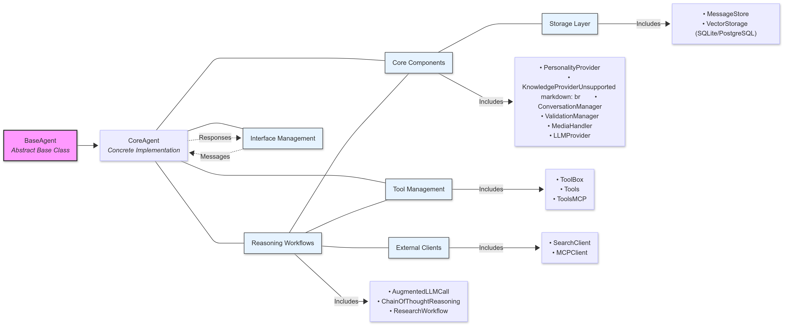

<div align="center">
    
</div>

# Heurist Agent Framework

A flexible multi-interface AI agent framework that can interact through various platforms including Telegram, Discord, Twitter, Farcaster, REST API, and MCP.

Grab a Heurist API Key instantly for free by using the code 'agent' while submitting the form on https://heurist.ai/dev-access

---

## Overview

The Heurist Agent Framework is built on a modular architecture that allows an AI agent to:

- Process text and voice messages
- Generate images and videos
- Interact across multiple platforms with consistent behavior
- Fetch and store information in a knowledge base (Postgres and SQLite supported)
- Access external APIs, tools, and a wide range of [Mesh Agents](./mesh/README.md) to compose complex workflows

## Table of Contents

- [Features](#features)
- [Heurist Mesh](#heurist-mesh)
  - [Why Heurist Mesh?](#why-heurist-mesh)
  - [Agent Categories](#agent-categories)
  - [Get Started with Mesh](#get-started-with-mesh)
  - [MCP Support](#mcp-support)
  - [Usage and Development Guide](#usage-and-development-guide)
- [Heurist Agent Framework Architecture](#heurist-agent-framework-architecture)
  - [Agent Structure](#agent-structure)
  - [Agent Interfaces](#agent-interfaces)
  - [Heurist Core](#heurist-core)
    - [Components](#components)
    - [Workflows](#workflows)
    - [Tool Management](#tool-management)
    - [External Clients](#external-clients)
  - [Agent Usage and Development Guide](#agent-usage-and-development-guide)
- [Development Setup](#development-setup)
- [How to Use GitHub Issues](#how-to-use-github-issues)
- [License](#license)
- [Contributing](#contributing)
- [Support](#support)
- [Star History](#star-history)

## Features

- 🤖 **Core Agent** - Modular framework with advanced LLM integration
- 🧩 **Component Architecture** - Plug-and-play components for flexible agent or agentic application design
- 🔄 **Workflow System** - RAG, Chain of Thought, and Research workflows
- 🖼️ **Media Generation** - Image creation and processing capabilities
- 🎤 **Voice Processing** - Audio transcription and text-to-speech
- 💾 **Vector Storage** - Knowledge retrieval with PostgreSQL/SQLite support
- 🛠️ **Tool Integration** - Extensible tool framework with MCP support
- 🌐 **Mesh Agent Access** - Connect to community-contributed specialized agents via API or MCP
- 🔌 **Multi-platform Support**:
  - Telegram bot
  - Discord bot
  - Twitter automation
  - Farcaster integration
  - REST API
  - MCP integration

## Heurist Mesh


**[Heurist Mesh](https://mesh.heurist.ai)** is the skills marketplace for AI agents - your gateway to Web3 intelligence. General-purpose AI models lack specialized knowledge about Web3 and often fail to deliver accurate results. Heurist Mesh solves this by providing 30+ specialized AI agents that are experts in crypto analytics, ready to give your applications or AI agents the Web3 expertise they need.

### Why Heurist Mesh?

- **Curated Web3 Tools**: We curate the best Web3 data sources and APIs, constantly monitored and updated for reliable performance.
- **Optimized for Agents**: Input/output formats optimized for AI agents - 70% fewer tool calls, 30-50% less token usage vs simple API wrappers.
- **Composable Architecture**: Mix and match specialized agents to build powerful workflows.
- **Flexible Access**: REST API with API key, [x402-enabled](https://docs.cdp.coinbase.com/x402) pay-per-use with USDC on Base, and MCP access.
- **Trusted Agent Standard**: Every agent MCP is registered on the [ERC-8004](https://eips.ethereum.org/EIPS/eip-8004) trusted agent standard on Ethereum.

### Agent Categories

| Category | Description | Example Agents |
|----------|-------------|----------------|
| **Aggregated Crypto Insights** | Comprehensive token and market intelligence (recommended) | Token Resolver, Trending Tokens, Twitter Intelligence |
| **Token Information** | Price data, market metrics, token analytics | CoinGecko, DexScreener, Bitquery, aixbt |
| **Social Media** | Twitter/X analysis, influencer tracking, sentiment | Elfa, Moni, Twitter Info |
| **Blockchain Data** | On-chain analytics, address intelligence, forensics | Etherscan, ChainBase, Space and Time |
| **Web Search** | Web research with AI summarization | Exa, Firecrawl, Caesar |
| **Crypto Products** | Platform-specific tools for DeFi and NFTs | Pump.fun, LetsBonk, Zora, Aave |
| **Wallet Analysis** | Portfolio tracking and wallet behavior analysis | Pond AI, GoPlus, Zerion |

### Get Started with Mesh

- **Mesh Portal**: [mesh.heurist.ai](https://mesh.heurist.ai) - Browse agents and deploy dedicated MCP servers
- **REST API**: [API Documentation](https://docs.heurist.ai/dev-guide/heurist-mesh/)
- **X402 API**: [mesh.heurist.xyz/x402/agents](https://mesh.heurist.xyz/x402/agents) - Pay-per-use with USDC on Base
- **Full Agent List**: [View all agents](./mesh/README.md#appendix-all-available-mesh-agents)

### MCP Support

All Heurist Mesh agents are accessible via MCP. This means you can access them from any AI clients and frameworks that support MCP, including Claude, ChatGPT, Cursor, LangChain, Google ADK, n8n, etc.

Visit [Heurist Mesh Console](https://mesh.heurist.ai/console) to view all MCP endpoints, and create private dedicated MCP servers by mixing and matching the agents that you need. The MCP server source code is available at [Github: heurist-mesh-mcp-server](https://github.com/heurist-network/heurist-mesh-mcp-server).

### Usage and Development Guide

[Read the Mesh documentation](./mesh/README.md)

## Heurist Agent Framework Architecture

[](https://deepwiki.com/heurist-network/heurist-agent-framework) 🔍 Click the badge to explore technical insights, ask questions.

The framework follows a modular, component-based architecture:

<div align="center">

</div>

### Agent Structure

1. **BaseAgent** (Abstract Base Class)

   - Defines the interface and common functionality
   - Manages component initialization and lifecycle
   - Implements core messaging patterns

2. **CoreAgent** (Concrete Implementation)
   - Implements BaseAgent functionality
   - Orchestrates components and workflows
   - Handles decision-making for workflow selection

### Agent Interfaces

Each interface inherits from BaseAgent and implements platform-specific handling:

- **Telegram** (`interfaces/telegram_agent.py`)
- **Discord** (`interfaces/discord_agent.py`)
- **API** (`interfaces/flask_agent.py`)
- **Twitter** (`interfaces/twitter_agent.py`)
- **Farcaster** (`interfaces/farcaster_agent.py`)

### Heurist Core

Heurist Core provides a set of core components, tools, and workflows for building LLM-powered agents or agentic applications. It can be used as a standalone package or as part of the Heurist Agent Framework.

[Read the Heurist Core documentation](./core/README.md)

#### Components

The framework uses a modular component system:

- **PersonalityProvider**: Manages agent personality and system prompts
- **KnowledgeProvider**: Handles knowledge retrieval from vector database
- **ConversationManager**: Manages conversation history and context
- **ValidationManager**: Validates inputs and outputs
- **MediaHandler**: Processes images, audio, and other media
- **LLMProvider**: Interfaces with language models
- **MessageStore**: Stores and retrieves messages with vector search

#### Workflows

Workflows provide higher-level reasoning patterns:

- **AugmentedLLMCall**: Standard RAG + tools pattern for context-aware responses
- **ChainOfThoughtReasoning**: Multi-step reasoning with planning and execution phases
- **ResearchWorkflow**: Deep web search and analysis with hierarchical exploration

#### Tool Management

- **ToolBox**: Base framework for tool definition and registration
- **Tools**: Tool management and execution layer
- **ToolsMCP**: Integration with MCP Protocol for tool execution

#### External Clients

- **SearchClient**: Unified client for web search (Firecrawl/Exa)
- **MCPClient**: Client for MCP Protocol for local or remote servers.

### Agent Usage and Development Guide

Read the [Agent Usage and Development Guide](./agents/README.md)

## Development Setup

To set up your development environment:

1.  **Install dependencies using uv:**

```bash
   uv sync
```

2.  **Activate the virtual environment:**

```bash
   source .venv/bin/activate  # On Windows: .venv\Scripts\activate
```

> [!NOTE]
> To run a file, you can use either `python <filename>.py` or `uv run <filename>.py`.

## How to Use GitHub Issues

We encourage the community to open **GitHub issues** whenever you have a new idea or find something that needs attention. When creating an issue, please use our [Issue Template](./.github/ISSUE_TEMPLATE/general_issue_template.md) and select one of the following categories:

1. **Integration Request**

   - For requests to integrate with a new data source (e.g., CoinGecko, arXiv) or a new AI use case.
   - **Most important** for the community, as these issues help drive the direction of our framework's evolution.
   - If you have an idea but aren't sure how to implement it, open an issue under this label so others can pick it up or offer suggestions.

2. **Bug**

   - For reporting errors or unexpected behavior in the framework.
   - Provide as much detail as possible (logs, steps to reproduce, environment, etc.).

3. **Question**

   - For inquiries about usage, best practices, or clarifications on existing features.

4. **Bounty**
   - For tasks with a **reward** (e.g., tokens, NFTs, or other benefits).
   - The bounty label indicates that Heurist team or another community member are offering a reward to whoever resolves the issue.
   - **Bounty Rules**:
     - Make sure to read the issue description carefully for scope and acceptance criteria.
     - Once your Pull Request addressing the bounty is merged, we'll follow up on fulfilling the reward.
     - Additional instructions (e.g., contact method) may be included in the issue itself.

### Picking Up an Issue

- Look for **Integration Requests** or **Bounty** issues if you want to contribute new features or earn rewards.
- Feel free to discuss approaches in the comments. If you're ready to tackle it, mention "I'm working on this!" so others know it's in progress.

This process helps us stay organized, encourages community involvement, and keeps development transparent.

## License

BSL 1.1 - See LICENSE file for details.

## Contributing

1. Fork the repository
2. Create a feature branch
3. Commit your changes
4. Push to the branch
5. Create a Pull Request

For Heurist Mesh agents or to learn about contributing specialized community agents, please refer to the [Mesh README](./mesh/README.md)

## Support

For support, please open an issue in the GitHub repository or contact the maintainers. Join the Heurist Ecosystem Builder telegram https://t.me/heuristsupport

## Star History

[](https://star-history.com/#heurist-network/heurist-agent-framework&Date)
